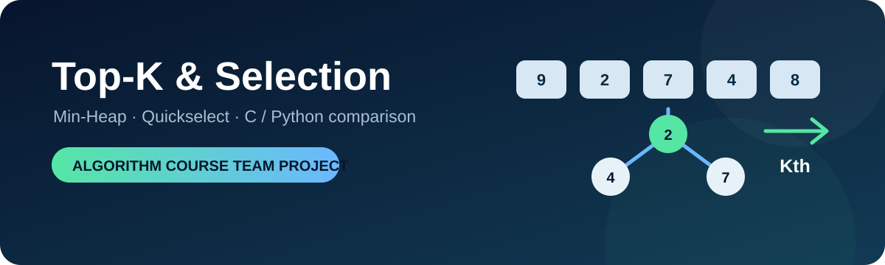

# Top-K & Selection Algorithms

<p align="center">
  
</p>

> 동일한 선택 문제를 서로 다른 알고리즘과 언어로 구현하며 시간·공간 복잡도와 구현 특성을 비교한 알고리즘 수업 팀 프로젝트입니다.

## 프로젝트 설명

전체 데이터를 완전히 정렬하지 않고도 필요한 상위 K개 또는 K번째 원소를 찾는 방법을 탐구했습니다. `Min-Heap`과 `Quickselect`를 중심으로 C와 Python 구현을 나란히 구성해, 이론적인 복잡도뿐 아니라 자료구조와 언어 선택이 코드에 미치는 차이도 확인했습니다.

| 구분 | Min-Heap | Quickselect |
|---|---|---|
| 핵심 아이디어 | 가장 큰 K개만 힙에 유지 | 피벗 기준으로 필요한 구간만 탐색 |
| 평균 시간 복잡도 | `O(n log k)` | `O(n)` |
| 추가 공간 | `O(k)` | 구현에 따라 `O(1)` 또는 재귀 스택 |
| 적합한 상황 | 스트리밍 입력, 작은 K | 정적 배열의 K번째 원소 선택 |

## 주요 기능

- 가장 큰 K개 또는 K번째로 큰 원소 계산
- 최소 힙 기반 Top-K 유지
- 무작위 피벗 기반 Quickselect
- C와 Python의 동일 알고리즘 구현 비교
- 입력 크기와 K 변화에 따른 복잡도 분석 기반 제공

## 개발 과정


1. 전체 정렬을 기준선으로 두고 불필요한 정렬 비용을 확인했습니다.
2. 크기 K의 최소 힙으로 후보를 제한해 `O(n log k)` 접근을 구현했습니다.
3. Quickselect가 피벗의 한쪽 구간만 재귀적으로 탐색하도록 구성했습니다.
4. 같은 로직을 C와 Python으로 작성해 메모리 관리와 표준 라이브러리 활용 차이를 비교했습니다.

## 담당 역할

- Top-K & Selection 문제 분석
- Min-Heap 및 Quickselect 구현과 비교
- 복잡도 분석
- 팀 발표 자료 구성

## 저장소 구성

```text
src/
├─ c/
│  ├─ min_heap.c
│  └─ quickselect.c
└─ python/
   ├─ min_heap.py
   └─ quickselect.py
```

## 프로젝트 범위 및 유의사항

- 학과 수업의 팀 과제를 포트폴리오 형태로 정리한 저장소입니다.
- 별도의 오픈소스 라이선스를 부여하지 않았으며, 코드 공개가 재사용·재배포 허가를 의미하지 않습니다.
- 발표 자료 원본은 팀원 개인 정보가 포함되어 있어 제외했습니다.
- 구현은 알고리즘 학습과 비교 분석을 목적으로 하며, 범용 라이브러리나 성능 보장 제품이 아닙니다.
